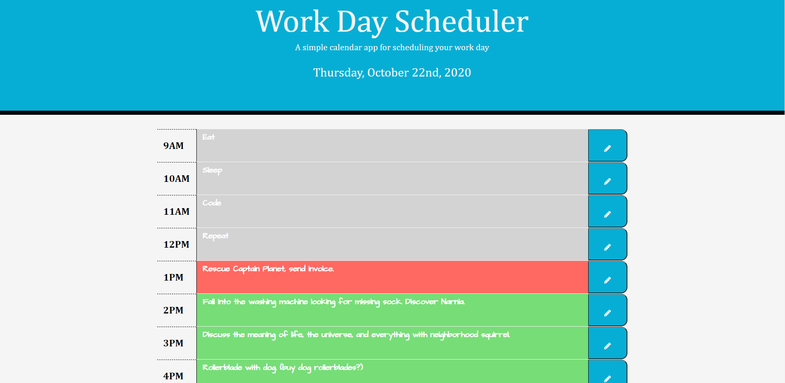

# Coding-Trivia-Game-

[Coding Trivia Game ](https://ewager1.github.io/Basic-Day-Planner/)

## Goal

To create a day planner utilizing jQuery with the following criteria:

- Planner has the current day, month, year at top of calendar 
- Planner containers blocks from 9AM to 5 PM
- Text Boxes change color based on if they are set in past, present, or future
- When the save button is clicked, it saved the textbox data to the local storage
- Text saved in text box even if page is refreshed 

## Positives:

1. Project achieves each of the pre-requisites.
2. I was able to take my logic from the for loops i'm used to and convert it into a .each function for
   the first time. 
3. I became much more comfortable using jQuery 

## Challenges and room for improvment:

1. 
